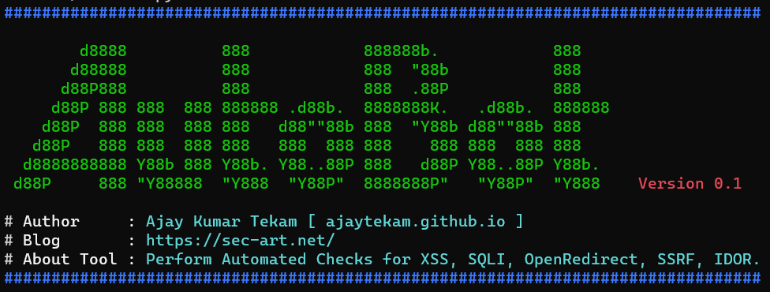

# Autobot 

Check for vulnerabilities on Passivelly collected URLs from tools [gau](https://github.com/lc/gau) and [waybackurls](https://github.com/tomnomnom/waybackurls) and send the result files and notofocatiosn messages to telegram Bot.  



### How It Works   

* Collect the urls, sort them.  
* Check the urls if they are alive or not. 
* Test for XSS vulnerability using dalfox.   
* Test for sql injection vulnerability using sqlmap.  
* Test for Open Redirect.   
* Test for Server side request forgery.   
* Test for IDOR.   

__Tools Used :__  gau, waybackurls, gf, dalfox, sqlmap, httpx, qsreplace, kxss, ffuf.  

### Help 

```  
usage: autobot.py [-h] -d DOMAIN [-o OUT] [-b BLIND] -i INTERACTSH

optional arguments:
  -h, --help            show this help message and exit
  -d DOMAIN, --domain DOMAIN
                        Domain name to perform Attack
  -o OUT, --out OUT     Output directory name
  -b BLIND, --blind BLIND
                        XSS hunter URL for Blind XSS inection Testing
  -i INTERACTSH, --interactSH INTERACTSH
                        InteractSH URL for Catching SSRF
```  

### Usage   

* Start [interactsh](https://github.com/projectdiscovery/interactsh) client instance and copy the url. 
* Run the application 

```  
python3 autobot -d testphp.vulnweb.com -i c65rgt1ufkgit27hcvq0cgf5o7eyyyyyn.interact.sh
```  

* for Blind XSS use [xsshunter]() url  

```    
python3 autobot -d testphp.vulnweb.com -b yoursubdomain.xss.ht -i c65rgt1ufkgit27hcvq0cgf5o7eyyyyyn.interact.sh
```     

### Setting-up Telegram Bot Configuration file

* Put your Telegram bot API Token and Chat Id into config.ini file and set path on `CONFIGPATH` variable `CONFIGPATH="/home/user/config.ini"` on line 18.
* Set `config.ini` file like this :

```
[telegram]
apiToken = 1234567890:ABCDEFghijklMNOPqRSTUVZXyzABCdefG-H
chatId = 123456789
```
